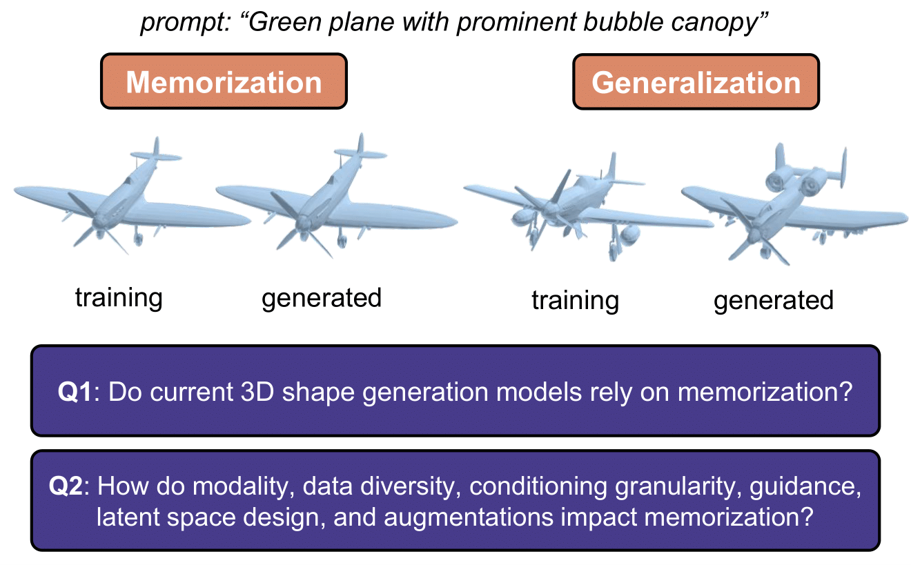

# [Memorization in 3D Shape Generation](http://arxiv.org/abs/2512.23628)
**Authors:** [Shu Pu](https://urrealhero.github.io/MyPersonalWeb/), [Boya Zeng](https://boyazeng.github.io/), Kaichen Zhou, [Mengyu Wang](https://wang.hms.harvard.edu/), [Zhuang Liu](https://liuzhuang13.github.io/)

[[arxiv](http://arxiv.org/abs/2512.23628)] [[project](https://urrealhero.github.io/3DGenMemorizationWeb/)]

Official implementation of [**"Memorization in 3D Shape Generation: An Empirical Study"**](http://arxiv.org/abs/2512.23628). This repository contains our evaluation framework for quantifying memorization ($Z_U$) and measuring generation quality (FPD), and the training code for our vector-set diffusion models ([hy3dshape](./model/)).

<div align="center">
  
  <br/>
  <i>In this paper, we propose a framework to evaluate memorization in 3D shape generation and use it to quantify the memorization in existing methods and understand how data and modeling designs impact memorization.</i>
</div>

<br/>


-----


## 0\. Environment Setup

Basic dependencies for most parts of the codebase are listed in [requirements.txt](./requirements.txt). For light-field-distance, please refer to the [instruction](./eval/retrieval/README.md).
```bash
pip install -r requirements.txt
```

## 1\. Evaluation Framework

### Step 1: LFD Retrieval

Navigate to [retrieval](./eval/retrieval/) to perform nearest-neighbor retrieval. This step generates the JSON files containing distances from generated samples ($Q$) and test samples ($P_{test}$) to the training set ($T$).

We recommend using **Light Field Distance (LFD)** as the retrieval metric, as it was found to be the most accurate in our benchmarks.

### Step 2: Memorization test ($Z_U$)

Use [compute_zu.py](./eval/compute_zu.py) to calculate the $Z_U$ score. This metric determines if the generative model is memorizing training data.

```bash
cd eval
python compute_zu.py gen_retrieval_results.json test_retrieval_results.json
```

### Step 3: Quality evaluation (FPD)

You can get Uni3D embedding database in [retrieval](./eval/retrieval/). Then, use [compute_fpd.py](./eval/compute_fpd.py) for FPD calculation.

```bash
cd eval
python compute_fpd.py reference.npz generated.npz
```

-----

## 2\. Model

The [model](./model/) directory contains the implementation of our 3D generative models. 

### Training
Our experiment use the `point_vec1024x32_dim1024_depth24_sdf_nb` in [VecSetX](https://github.com/1zb/VecSetX) autoencoder, to download the pretrained weights, please follow the instructions in the its repository. 


We provide a simple training command below. Please modify the configuration file path, output directory, and other parameters as needed.
```
python main.py --fast -c PATH/TO/CONFIG.yaml -nn 1 -ng 8 -a --amp_type 32 --output_dir PATH/TO/OUTPUT_DIR (--deepspeed --ckpt_path PATH/TO/CHECKPOINT/FOR/AUTO_RESUME)
```

You can find example configuration files in [model/configs](./model/configs/).
Most of the training settings can be modified through the configuration file.


### Inference
We provide simple inference commands below. 

**Text-conditional generation**
```
python inference.py \
    --config configs/Baseline.yaml \
    --ckpt PATH/TO/CHECKPOINT \
    --out_dir outputs_text/ \
    --num_samples 4 \
    --text "a chair"
```

**Class-conditional generation**
Details of the mapping from class names to class IDs can be found in [model/utils/mapping.json](./model/utils/mapping.json).
```
python inference.py \
    --config configs/Conditioning/LVIS-16-Category.yaml \
    --ckpt PATH/TO/CHECKPOINT \
    --out_dir outputs_lvis/ \
    --num_samples 4 \
    --class_id 0
```

**Image-conditional generation**
```
python inference.py \
    --config configs/Conditioning/Image.yaml \
    --ckpt PATH/TO/CHECKPOINT \
    --out_dir outputs_image \
    --num_samples 1 \
    --image_path data_sprite.png \
    --image_views 12 \
    --image_pick random
```

[Pretrained models](https://huggingface.co/pudashi/3DGenMem)

-----

## 3\. Data Curation & Captioning

The entire curated 3D shape dataset is located at [model/utils/top100](./model/utils/top100/). You can use `model_uid` to download 3D assets from [Objaverse-XL](https://objaverse.allenai.org/).

**[build_caption_label_pairs.py](./data/build_caption_label_pairs.py)**: Matches raw captions to the best object category.


```bash
cd data
python build_caption_label_pairs.py \
  --csv input_data.csv \
  --labels labels_list.txt \
  --out_csv step1_output.csv \
  --threshold 0.70
```

**[filter_caption_label_pairs.py](./data/filter_caption_label_pairs.py)**: Filters out bad captions and removes color/material descriptions using Qwen3.

```bash
cd data
python filter_caption_label_pairs.py \
  --in_csv step1_output.csv \
  --out_csv final_data.csv \
  --model_name "Qwen/Qwen3-4B-Instruct-2507"
```


**[generate_multigranularity_captions.py](./data/generate_multigranularity_captions.py)**: Multi-view images captioning using Qwen3-VL models (supports 8B and MoE). It generates structured JSON outputs containing three levels of detail: a short phrase, a sentence, and a detailed paragraph.

```bash
cd data
python generate_multigranularity_captions.py \
  --metadata_csv input_images.csv \
  --output_csv step3_captions.csv \
  --model_id "Qwen/Qwen3-VL-8B-Instruct" \
  --num-views 12 \
  --views-per-sample 4 \
  --batch-size 32
```


## 4\. Acknowledgements

We deeply appreciate the open-source contributions that made this research possible. We would like to specifically acknowledge and thank the authors of the following projects for their excellent work:

* **[sdf_gen](https://github.com/1zb/sdf_gen?tab=readme-ov-file)**: Used for mesh normalization and SDF generation processing.
* **[LFD](https://github.com/kacperkan/light-field-distance) and [GET3D](https://github.com/nv-tlabs/GET3D)**: For Light Field Distance (LFD) implementation.
* **[data-copying](https://github.com/casey-meehan/data-copying/tree/master)**: The original implementation of the Data Copying Test ($Z_U$), which serves as the core of our memorization evaluation.
* **[3DShape2Vecset (VecSetX)](https://github.com/1zb/VecSetX)**: For the Vecset autoencoder used in our experiments.
* **[Hunyuan3D 2.1](https://github.com/Tencent-Hunyuan/Hunyuan3D-2.1)**: For providing the robust diffusion backbone and training framework.


## Citation
If you find our work or code useful for your research, please consider citing:
```text
@article{pu2025memorization,
  title={Memorization in 3D Shape Generation: An Empirical Study},
  author={Pu, Shu and Zeng, Boya and Zhou, Kaichen and Wang, Mengyu and Liu, Zhuang},
  journal={arXiv preprint arXiv:2512.23628},
  year={2025}
}
```